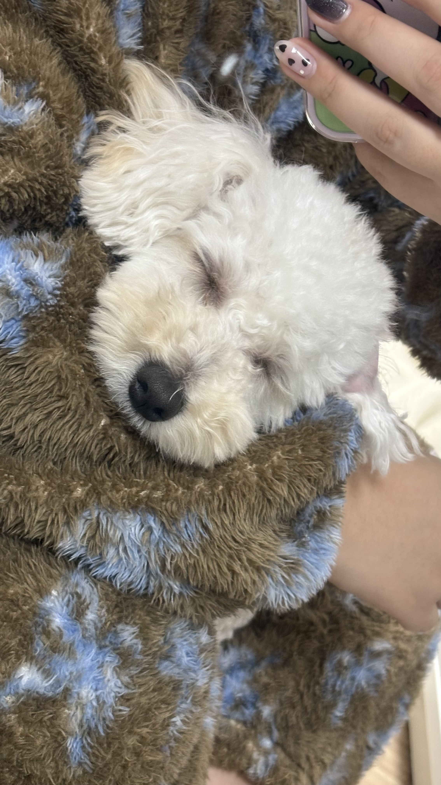
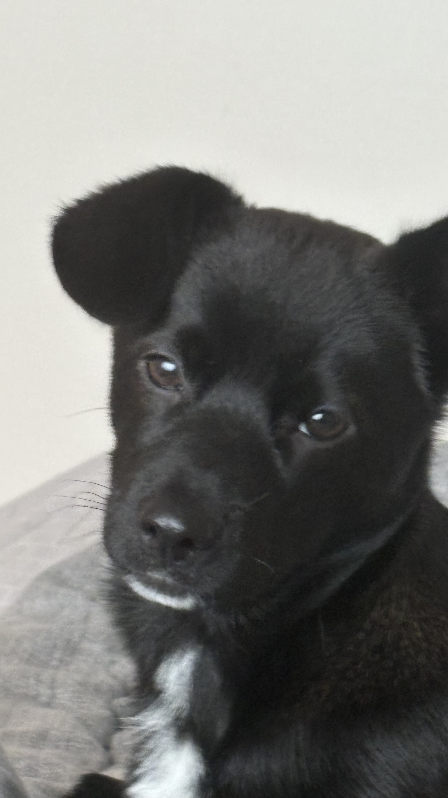

# 반갑습니다 😊
 
|구분|내용|
|:---:|:---:|
|출생|1997년 1월 15일 (29세)|
|출생지|광주광역시|
|인삿말|안녕하세요~! 잠실에서 아내와 강아지 2마리와 함께 살고 있는 이지행입니다!|

## 1.Family👨‍👩‍👧‍👦
  ### 아내 **김주희**❤️  
  ### 강아지 **지유**🐶-2023년 8월 24일생 푸숑  
  ### 강아지 **하울이**🐶-2024년 7월 24일생 ?? 

## 2.Interests🐶
  -**올림픽공원** 산책  
  -보드게임 **테라포밍마스**  
  -닌텐도 **별의커비 디스커버리**  
  -예능 **독박투어** 

  
## 3.Skills🖥️
  -Technical Skills: [x]Python [x]JavaScript [x]SQL  
  -Soft Skills: [v]Communication [v]Teamwork  
  -Tools/Frameworks: [v]Git 

## 4.Experience👨‍💼
  -쿠팡풀필먼트서비스유한회사 2025 
  -경찰청 2021~2022
  
## 5.Education🏫
  -경찰대학 행정학과 2021년도 졸업

## 6.Certifications📚
  -바둑 1단 
  -한자 1급 
  -컴활 2급 
  -워드프로세서 1급

## 7.Contact📫
  -Email: xwlgodx@gmail.com, xwlgodx@naver.com 
  -Github: [https://github.com/goergelee970115] 
  -Phone: (+82) 010-8278-8225

## 8.Etc🤔
  -MBTI: ISTJ 
  -혈액형: B형
  
